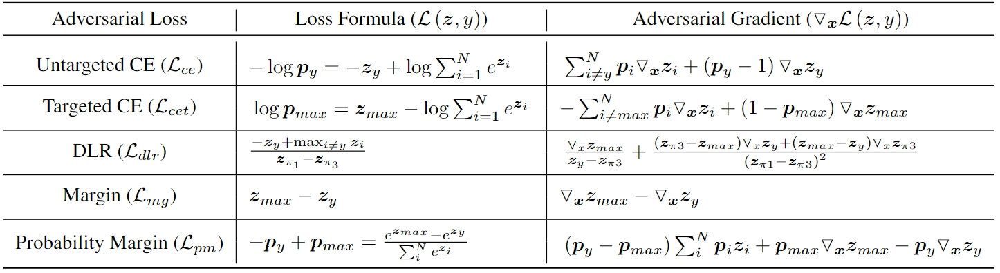

## Introduction
This is a white-box attack toolkit that can be used to measure the robustness of deep neural network models.

Our key contributions are:
- **"Imbalanced Gradients: A Subtle Cause of Overestimated Adversarial Robustness"**

We identify a new type of effect called imbalanced gradients, which can cause overestimated adversarial robustness and cannot be detected by detection methods for obfuscated gradients. And we propose Margin Decomposition (MD) attacks to exploit imbalanced gradients.

- **"Probability Margin Attack: A Stronger Baseline for White-box Adversarial Robustness Evaluation"**

We propose a novel attack method called Probability Margin Attack (PMA) that introduces a probability margin loss(PM).


## Related Work
我们总结了白盒攻击中常用的损失函数和攻击策略
- Loss Function List



- Attack Method List
  
| Strategy | Loss Function | Remarks |
|:--------|:-------------|:-------|
| PGD | ce/cet/dlr/mg/pm/mi/alt | Single attack, untargeted attack |
| APGD | ce/cet/dlr/mg/pm/mi | Single attack, untargeted attack |
| APGDT | dlr/mg/pm | Single-target attack, multi-objective attack |
| MD | mg | Single-target attack, untargeted attack |
| FAB | - | Single-target attack, untargeted attack |
| PMA | pm | Single-target attack, untargeted attack |
| PMA+ | - | Ensemble attacks, PMA+APGDT |


## Usage

### Installation
```bash
git clone https://github.com/yourusername/whiteboxattack.git
```

### Example


