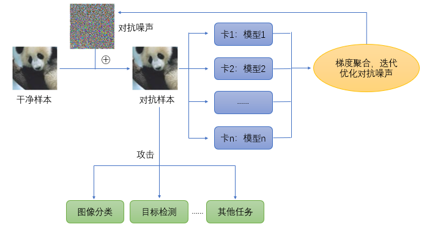

# Introduction
This project is an open-source toolbox for crafting transferable adversarial attacks on visual models. It supports generating and evaluating adversarial examples based on multiple pre-trained feature extractors. Pre-generated adversarial datasets are also provided, ready for download and evaluation without the need for further generation.

## Methodology


We generate highly transferable adversarial examples by perturbing in parallel at the feature layer using multiple pre-trained image encoders.

## Highlights
### Multi Grahics Cards and Multi Models, Enhanced Transferability
We utilize multiple graphics cards and multiple models to enhance the transferability of adversarial examples. By employing 8 mainstream pre-trained image feature extractors for feature extraction and perturbation at the feature layer, we generate highly transferable adversarial examples.

### Million-Level Evaluation, General and Accurate
We provide a million-level dataset, cc1m, constructed based on cc3m. The large number of samples allows for more accurate evaluation of model robustness (generalization). One dataset can be used to evaluate all downstream tasks.

### Ready to use
We offer pre-generated adversarial versions of multiple datasets, including ImageNet-1k, COCO2017, ADE20k, and cc1m. These are ready to use without requiring users to generate them again.

# Tutorial
## Installation
Download the source code from GitHub for usage.

## Usage
### Adversarial Example Dataset Generation
#### Parameter List

| Parameter Name|Type	|Meaning |
| --- | --- | --- |
| dataset	    |string	|Name of the dataset|
| data_path	    |string	|Root path of the dataset|
| batch_size	|int	|Batch size|
| random	    |bool	|Random initialization|
| loss	        |string	|Loss function|
| epsilon	    |float	|Attack budget|
| num_steps	    |int	|Number of attack steps|
| step_size	    |float	|Step size|
| optim	        |string	|Optimizer for adversarial noise optimization|
| jpeg_resistant|bool	|Enable JPEG compression-resistant adversarial attacks|

#### Execution
```
python attack.py 
```

### Model Transferability Adversarial Evaluation
#### Example: Robustness Evaluation for Image Classification Tasks
```
python eval/imagenet_classification.py --model_name=vit_base_patch16_224 --model_path=<your/model/path> --output=./ --clean_path=<your/imagenet/path> --adv_path=<your/adversarial imagenet/path>
```

# Acknowledgements
We thank the timm library for providing model architectures and weights, as well as other open-source datasets. Below are the feature extractors and datasets we utilized in detail.

## Feature Extractors
We selected 8 mainstream feature extractors from the timm library for generating adversarial examples, which include various model architectures and pre-training methods, as detailed below:

| model name | paper |
| --- | --- |
| vgg16 | Simonyan K, Zisserman A. Very deep convolutional networks for large-scale image recognition[J]. arXiv preprint arXiv:1409.1556, 2014. |
| resnet101 | He K, Zhang X, Ren S, et al. Deep residual learning for image recognition[C]//Proceedings of the IEEE conference on computer vision and pattern recognition. 2016: 770-778. |
| efficient net | Tan M, Le Q. Efficientnet: Rethinking model scaling for convolutional neural networks[C]//International conference on machine learning. PMLR, 2019: 6105-6114.
| convnext_base | Liu Z, Mao H, Wu C Y, et al. A convnet for the 2020s[C]//Proceedings of the IEEE/CVF conference on computer vision and pattern recognition. 2022: 11976-11986. |
| vit_base_patch16_224 | Dosovitskiy A, Beyer L, Kolesnikov A, et al. An image is worth 16x16 words: Transformers for image recognition at scale[J]. arXiv preprint arXiv:2010.11929, 2020. |
| vit_base_patch16_224.dino | Caron M, Touvron H, Misra I, et al. Emerging properties in self-supervised vision transformers[C]//Proceedings of the IEEE/CVF international conference on computer vision. 2021: 9650-9660. |
| beit_base_patch16_224 | Bao H, Dong L, Piao S, et al. Beit: Bert pre-training of image transformers[J]. arXiv preprint arXiv:2106.08254, 2021. |
| swin_base_patch4_window7_224 | Liu Z, Lin Y, Cao Y, et al. Swin transformer: Hierarchical vision transformer using shifted windows[C]//Proceedings of the IEEE/CVF international conference on computer vision. 2021: 10012-10022. |

## Datasets

| dataset name | paper |
| --- | --- |
| CC3M | Sharma P, Ding N, Goodman S, et al. Conceptual captions: A cleaned, hypernymed, image alt-text dataset for automatic image captioning[C]//Proceedings of the 56th Annual Meeting of the Association for Computational Linguistics (Volume 1: Long Papers). 2018: 2556-2565. |
| ImageNet | Deng J, Dong W, Socher R, et al. Imagenet: A large-scale hierarchical image database[C]//2009 IEEE conference on computer vision and pattern recognition. Ieee, 2009: 248-255. |
| COCO | Lin T Y, Maire M, Belongie S, et al. Microsoft coco: Common objects in context[C]//Computer Vision–ECCV 2014: 13th European Conference, Zurich, Switzerland, September 6-12, 2014, Proceedings, Part V 13. Springer International Publishing, 2014: 740-755. |
| ADE20k | Zhou B, Zhao H, Puig X, et al. Scene parsing through ade20k dataset[C]//Proceedings of the IEEE conference on computer vision and pattern recognition. 2017: 633-641. |
| CheXpert | Irvin J, Rajpurkar P, Ko M, et al. Chexpert: A large chest radiograph dataset with uncertainty labels and expert comparison[C]//Proceedings of the AAAI conference on artificial intelligence. 2019, 33(01): 590-597. |
